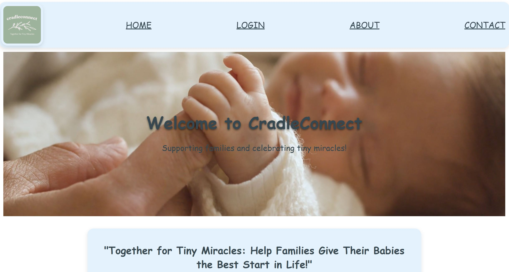
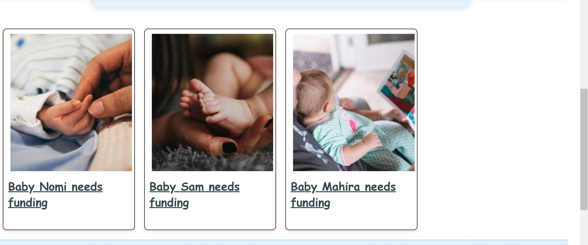
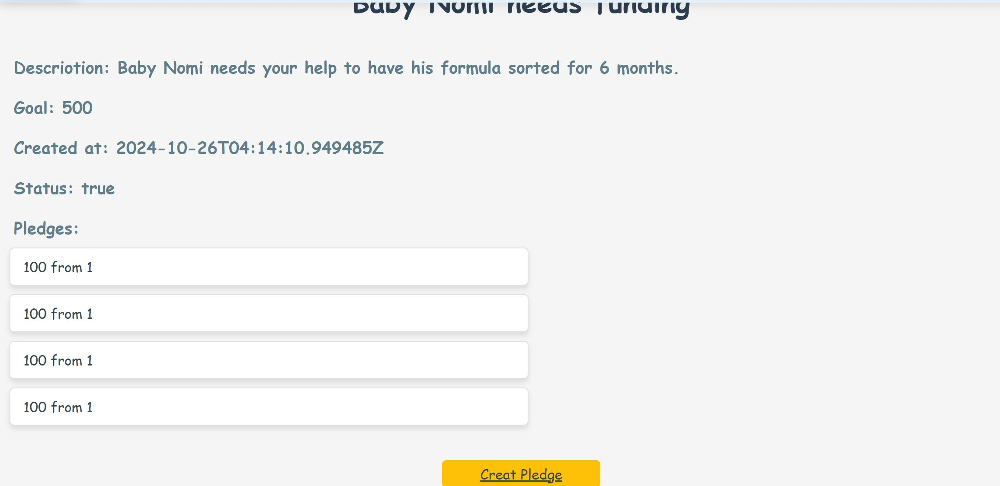

React Project: Crowdfunding App (Part 2)
Due: Last Sunday of the module at 11:59pm.
Project Description
Kickstarter, Go Fund Me, Kiva, Change.org, Patreon… All of these different websites have something in common: they provide a platform for people to fund projects that they believe in, but they all have a slightly different approach. You are going to create your own crowdfunding website (this time the front-end), and put your own spin on it!

Project Requirements
Here's a reminder of the required features. Your crowdfunding project must:

xx Be separated into two distinct projects: an API built using the Django Rest Framework and a website built using React.
xx Have a cool name, bonus points if it includes a pun and/or missing vowels. See https://namelix.com/ for inspiration. (Bonus Points are meaningless)
xx Have a clear target audience.
xx Have user accounts. A user should have at least the following attributes:
xx Username
xx Email address
xx Password
xx Ability to create a “project” to be crowdfunded which will include at least the following attributes:
xx Title
xx Owner (a user)
xx Description
xx Image
xx Target amount to fundraise
xx Whether it is currently open to accepting new supporters or not
xx When the project was created
xx Ability to “pledge” to a project. A pledge should include at least the following attributes:
xx An amount
xx The project the pledge is for
xx The supporter/user (i.e. who created the pledge)
xx Whether the pledge is anonymous or not
xx A comment to go along with the pledge
xx Implement suitable update/delete functionality, e.g. should a project owner be allowed to update a project description?
xx Implement suitable permissions, e.g. who is allowed to delete a pledge?
xx Return the relevant status codes for both successful and unsuccessful requests to the API.
xx Handle failed requests gracefully (e.g. you should have a custom 404 page rather than the default error page).
xx Use Token Authentication.
xx Implement responsive design.
Additional Notes
No additional libraries or frameworks, other than what we use in class, are allowed unless approved by the Lead Mentor.

Note that while this is a crowdfunding website, actual money transactions are out of scope for this project.

Submission
To submit, fill out this Google form, including a link to your Github repo. Your lead mentor will respond with any feedback they can offer, and you can approach the mentoring team if you would like help to make improvements based on this feedback!

Please include the following in your readme doc:

xx A link to the deployed project.
   https://mellow-daifuku-47e84d.netlify.app/
xx A screenshot of the homepage

xx A screenshot of the project creation page

xx A screenshot of the project creation form

xx A screenshot of a project with pledges\

xx A screenshot of the resulting page when an unauthorized user attempts to edit a project (optional, depending on whether or not this functionality makes sense in your app!)
there is no option for an unauthorized user to edit the projects.
